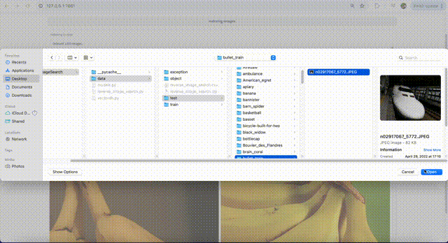

# Reverse Image Search
A simple Reverse Image Search function uses Resnet50 to extract the features of all images in the directory, and uses Milvus as a vector database to store and query similar images.  
  
The UI is shown below:

<p align="center">
  
</p>

<br/>
<br/>
<br/>
  
You can run the following script to start the Gradio web UI:
```bash
python3 reverse_image_search.py
```
  
<br/>
A brief description video is below:
<br/>
https://www.bilibili.com/video/BV1oi421m7mR
<br/>
<br/>
中文解释文档在<a href="document_zh.pdf">这里</a>。
<br/>

---

If you can't run it directly, you may need to do some preparation, including but not limilited to:

- Install libaray:
```bash
pip3 install gradio pymilvus torch
```
- Prepare dataset:
```bash
$ cd data
$ curl -L http://github.com/towhee-io/examples/releases/download/data/reverse_image_search.zip -O
$ unzip -q -o reverse_image_search.zip
```
- Install vector database:
```bash
$ wget http://github.com/milvus-io/milvus/releases/download/v2.2.10/milvus-standalone-docker-compose.yml -O docker-compose.yml
$ docker-compose up -d
$ docker ps
```
